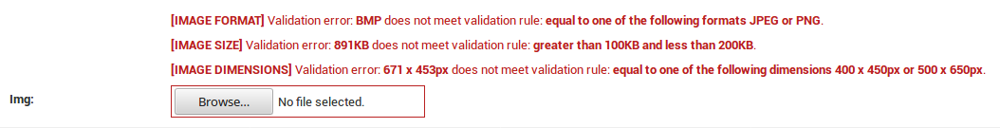

.. _examples:

Examples
========

The following examples try to cover a variety of |config_name| :ref:`usages <usage>` by combining
different specificity values and showing their effect on the appropriate fields.

With specificity 1
------------------

The validation rule below will be applied to all ``ImageField``'s of the ``my_app`` app.
Each image should be *less than 120KB* **and** *have aspect ratio equal to 1.2*.
::

    VIMAGE = {
        'my_app.models': {
            'SIZE': {
                'lt': 120,
            }
            'ASPECT_RATIO': 1.2,
        },
    }

If we try to upload an image which is more than 120KB and it's aspect ratio is not 1.2 then we'll get the following default error:

Since ``'SIZE'`` is a ``dict`` we can define an ``'err'`` key and give it a :ref:`custom error <custom_error_note>`:
::

    VIMAGE = {
        'my_app.models': {
            'SIZE': {
                'lt': 120,
                'err': 'Wrong size. Must be < 120KB',
            }
            'ASPECT_RATIO': 1.2,
        },
    }

which yields:

With specificity 2
------------------

The validation rule below will be applied to all ``ImageField``'s of the ``MyModel`` model.
Each image should be *a JPEG image*, *equal to 400 x 500px* **and** *less than 200KB*.
::

    VIMAGE = {
        'my_app.models.MyModel': {
            'FORMAT': 'jpeg',
            'DIMENSIONS': (400, 500),
            'SIZE': {
                'lt': 200,
            },
        },
    }

With specificity 3
------------------

The validation rule below will be applied only to the ``img`` ``ImageField`` field.
It should *be a JPEG or a PNG image*, *the height should be less than 400px* **and** *be greater than 100KB but less than 200KB*.
::

    VIMAGE = {
        'my_app.models.MyModel.img': {
            'FORMAT': ['jpeg', 'png'],
            'DIMENSIONS': {
                'h': {
                    'lt': 400,
                }
            },
            'SIZE': {
                'gt': 100,
                'lt': 200,
            },
        },
    }

Trying to save the object with an *invalid* image, we get the following default error:

A custom error on ``'h'`` (height) may be declared, as follows:
::

    VIMAGE = {
        'my_app.models.MyModel': {
            'FORMAT': ['jpeg', 'png'],
            'DIMENSIONS': {
                'h': {
                    'lt': 400,
                    'err': '<strong>Height</strong> must be <em>>400px</em>',
                }
            },
            'SIZE': {
                'gt': 100,
                'lt': 200,
            },
        },
    }

Trying with an *invalid* image, we get (note that we have provided a valid image format, so the ``'FORMAT'`` validation passes and not shown):

With specificity 1 + 2
----------------------

::

    VIMAGE = {
        # specificity 1
        'my_app.models': {
            'FORMAT': ['jpeg', 'png'],
            'SIZE': {
                'gt': 100,
                'lt': 200,
            },
        },
        # specificity 2
        'my_app.models.ModelOne': {
            'DIMENSIONS': [(400, 450), (500, 650)],
        },
        # specificity 2
        'my_app.models.ModelTwo': {
            'FORMAT': ['webp'],
        },
    }

After declaring the above validation rule, the following rules will apply:

+----------------------------------------------+-------------------------------------------------------+
| all ``ImageField``'s of the                  | Rules                                                 |
+==============================================+=======================================================+
|                                              | - ``'FORMAT': ['jpeg', 'png']``                       |
| ``ModelOne`` model                           | - ``'SIZE': {'gt': 100, 'lt': 200}``                  |
|                                              | - ``'DIMENSIONS': [(400, 450), (500, 650)]``          |
+----------------------------------------------+-------------------------------------------------------+
| ``ModelTwo`` model                           | - ``'FORMAT': ['webp']``                              |
|                                              | - ``'SIZE': {'gt': 100, 'lt': 200}``                  |
+----------------------------------------------+-------------------------------------------------------+

and providing (again) an *invalid* image, we get the following default error for the ``img`` ``ImageField`` inside the ``ModelOne`` model:

With specificity 1 + 3
----------------------

::

    VIMAGE = {
        # specificity 1
        'my_app.models': {
            'DIMENSIONS': {
                'lte': (1920, 1080),
            },
            'FORMAT': 'jpeg',
            'SIZE': {
                'gt': 100,
                'lt': 200,
            },
        },
        # specificity 3
        'my_app.models.ModelOne.img': {
            'DIMENSIONS': (800, 1020),
        },
    }

After declaring the above validation rule, the following rules will apply:

+---------------------------------------------------+-------------------------------------------------------+
| Fields                                            | Rules                                                 |
+===================================================+=======================================================+
| all ``ImageField``'s of the ``my_app`` app        | - ``'DIMENSIONS': {'lte': (1920, 1080)}``             |
|                                                   | - ``'FORMAT': 'jpeg'``                                |
|                                                   | - ``'SIZE': {'gt': 100, 'lt': 200}``                  |
+---------------------------------------------------+-------------------------------------------------------+
| only the ``img`` field                            | - ``'DIMENSIONS': (800, 1020)``                       |
|                                                   | - ``'FORMAT': 'jpeg'``                                |
|                                                   | - ``'SIZE': {'gt': 100, 'lt': 200}``                  |
+---------------------------------------------------+-------------------------------------------------------+
