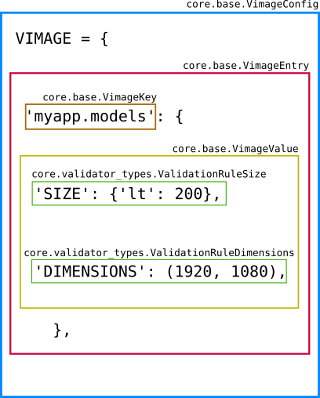

.. _how-it-works:

How it works
============

The mechanism, under the hood, of the |config_name| is pretty simple.

In a glance it does the following:

- *converts* each rule dict (i.e ``{'SIZE': 100}`` etc) to a corresponding ``class``.
- each ``class`` defines a method which returns a function (callable, the validator)
- a registry is build which has the ``ImageField`` as keys and a list of functions (validators) as the value
- finally, each validator is added to the ``ImageField``'s ``validators`` attribute (a method defined as a ``cached_property``)

For more info about Model ``validators`` refer to `validators <https://docs.djangoproject.com/en/dev/ref/validators/>`_.
